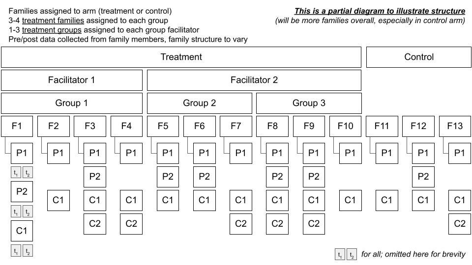

```{r setup, include=FALSE}
  knitr::opts_chunk$set(echo = TRUE, message = FALSE, warning = FALSE,
                        cache = TRUE)
```

# Introduction

In this trial, families will be assigned to a treatment or an inactive control arm. Families assigned to treatment will be nested in groups that are assigned to facilitators. Data will be collected from all eligible family members before (?) and after the intervention is delivered to families assigned to the treatment arm.

```{r, echo=FALSE}
  
```

# Approach

We will conduct a Bayesian power simulation similar to what Kurz does in [this post](https://solomonkurz.netlify.app/post/bayesian-power-analysis-part-i/).

## Function to simulate data

The first step is to create a function to simulate data for this structure. We're using the {[faux](https://debruine.github.io/faux/articles/sim_mixed.html)} package.

```{r packages}
# load the necessary packages
  library(faux)
  library(tidyverse)
  library(lme4)
  library(broom.mixed)
  library(broom.helpers)
  library(brms)
  library(cmdstanr)
  library(tidybayes)
  library(sjPlot)
```

I'm unsure about:

1. Setting group and facilitator columns to 0 for control arms
2. Setting group/facilitator random effects to 0 for control arms
3. Setting group/facilitator random effects to 0 for pre observations
4. Omitting random slopes
5. Calculating dv: see `(b1 * treatment * post)`

```{r function}
#' Simulate data
#' @param seed  simulation seed
#' @param n_facilitator number of group facilitators
#' @param grp_per_fac_lo number of groups per facilitator, low end
#' @param grp_per_fac_hi number of groups per facilitator, high end
#' @param fam_per_gro_lo number of families per group, low end
#' @param fam_per_gro_hi number of families per group, high end
#' @param mem_per_fam_lo number of members per family, low end
#' @param mem_per_fam_hi number of members per family, high end
#' @param b0 intercept
#' @param b1 fixed effect of arm
#' @param u0l_sd random intercept SD for facilitators
#' @param u0g_sd random intercept SD for groups
#' @param u0f_sd random intercept SD for families
#' @param u0m_sd random intercept SD for members
#' @param u0t_sd random intercept SD for time
#' @param sigma_sd error term
#' @param attrition_post_trt post attrition in treatment arm
#' @param attrition_post_ctr post attrition in control arm

  sim <- function(n_facilitator, 
                  grp_per_fac_lo,
                  grp_per_fac_hi,
                  fam_per_gro_lo,
                  fam_per_gro_hi,
                  mem_per_fam_lo,
                  mem_per_fam_hi,
                  b0 = 0,
                  b1 = 0,       
                  u0l_sd = 0,   
                  u0g_sd = 0,   
                  u0f_sd = 0,   
                  u0m_sd = 0,   
                  u0t_sd = 0,   
                  sigma_sd = 0,
                  attrition_post_trt = 0,
                  attrition_post_ctr = 0,
                  ... # helps the function work with pmap() 
                  ) {
    
# calculate nesting parameters
  if (grp_per_fac_lo==grp_per_fac_hi) {
    n_groups_per_facilitator <- grp_per_fac_lo
    n_groups <- n_groups_per_facilitator * n_facilitator
  } else {
    n_groups_per_facilitator = sample(grp_per_fac_lo:grp_per_fac_hi, 
                                      n_facilitator, replace = TRUE)
    n_groups <- sum(n_groups_per_facilitator)
  }
    
  if (fam_per_gro_lo==fam_per_gro_hi) {
    n_families_per_group <- fam_per_gro_lo
    n_families <- n_families_per_group * n_groups
  } else {
    n_families_per_group = sample(fam_per_gro_lo:fam_per_gro_hi,
                                  n_groups, replace = T)
    n_families <- sum(n_families_per_group)
  }
    
  if (mem_per_fam_lo==mem_per_fam_hi) {
    n_members_per_family <- mem_per_fam_lo
    n_members <- n_members_per_family * n_families
  } else {
    n_members_per_family = sample(mem_per_fam_lo:mem_per_fam_hi,
                                  n_families, replace = T)
    n_members <- sum(n_members_per_family)
  }
  
# simulate data
  df <- add_random(facilitator = n_facilitator) %>%
    add_random(group = n_groups_per_facilitator, 
               .nested_in = "facilitator") %>%
    add_random(family = n_families_per_group, .nested_in = "group") %>%
    add_random(member = n_members_per_family, .nested_in = "family") %>%
    add_within("member", time = c("pre", "post")) %>%
    add_between(.by = "group",
                arm = c("treatment", "control")) %>%
    add_recode("arm", "treatment", control = 0, treatment = 1) %>%
    add_recode("time", "post", pre = 0, post = 1) %>%
  # remove group/facilitator nesting for control arm
    mutate(facilitator = as.numeric(gsub("f", "", facilitator)),
           facilitator = case_when(
             arm == "control" ~ 0,
             TRUE ~ facilitator
    )) %>%
    mutate(group = as.numeric(gsub("g", "", group)),
           group = case_when(
             arm == "control" ~ 0,
             TRUE ~ group
    )) %>%
    mutate(family = as.numeric(gsub("f", "", family)),
           member = as.numeric(gsub("m", "", member))
           ) %>%
  # add random intercepts
    add_ranef("facilitator", u0l = u0l_sd) %>%
    add_ranef("group", u0g = u0g_sd) %>%
    add_ranef("family", u0f = u0f_sd) %>%
    add_ranef("member", u0m = u0m_sd) %>%
    add_ranef("time", u0t = u0t_sd) %>%
    add_ranef(sigma = sigma_sd) %>%
  # set group/facilitator random effects to 0 for control
    mutate(across(c(u0l, u0g), ~ case_when(arm == "control" ~ 0, 
                                           TRUE ~ .x))) %>%
  # set group/facilitator random effects to 0 for pre
    mutate(across(c(u0l, u0g), ~ case_when(time == "pre" ~ 0, 
                                           TRUE ~ .x))) %>%
  # TEMPORARY: Limit to 1 member per family
    distinct(family, time, .keep_all = TRUE) %>%
  # calculate DV
    mutate(dv = b0 + u0l + u0g + u0f + u0m + u0t + 
             (b1 * treatment * post) + sigma) %>%
  # reshape
    select(member, time, family, treatment, group, facilitator, dv) %>%
    pivot_wider(id_cols = c(member, family, treatment, group, facilitator),
                names_from = time,
                values_from = dv) %>%
  # scale
    # mutate(pre = scale(pre),
    #        post = scale(post)) %>%
    rename(y_pre = pre,
           y_post = post) %>%
  # attrition
  # TODO NOT SET UP FOR MULTIPLE FAMILY MEMBERS
    group_by(treatment) %>%
    nest() %>%
    mutate(p = case_when(
      treatment==1 ~ attrition_post_trt,
      TRUE ~ attrition_post_ctr
    )) %>%
    mutate(data = purrr::map(data, ~ mutate(.x, 
                                            missing = rbinom(n(), 1, p)))) %>% 
    unnest() %>%
    ungroup() %>%
    mutate(y_post = case_when(
      missing == 1 ~ NA_real_,
      TRUE ~ y_post
    )) %>%
    select(-p, -missing)
  }
```

## Check the function

Let's imagine that the dv is a composite scale, specifically the mean of 32 items with possible values of 1 to 5. Thus, the dv can range from 1 to 5. Higher scores represent better family functioning. Let's also imagine that we recruit distressed families, so the baseline mean is 2

I'm unsure about:

1. How to set the random effects (I think family and member should remain 0 because we're only dealing with 1 member per household at the moment)
2. Does this look right?

```{r}
  set.seed(8675309)
  df <- sim(# number of facilitators
                n_facilitator = 10, 
              # assume facilitators have 4 groups
                grp_per_fac_lo = 4, grp_per_fac_hi = 4,
              # assume groups have 4 families
                fam_per_gro_lo = 4, fam_per_gro_hi = 4,
              # assume families have 2-5 members
                mem_per_fam_lo = 2, mem_per_fam_hi = 5,
              # model parameters
                b0 = 2,             # grand mean
                b1 = 0.21,             # treatment effect on raw metric
                u0l_sd = 0,   
                u0g_sd = 0,   
                u0f_sd = 0,         # TEMP: set to 0 to look at 1 member/fam
                u0m_sd = 0,         # TEMP: set to 0 to look at 1 member/fam
                u0t_sd = 0,   
                sigma_sd = .68)
```

```{r}
# look at the data
  df

# families per arm
  df %>% count(treatment)
```

Note: If there are varying numbers of families, there will not be a 1:1 allocation of families to arm.

```{r, results="hide"}
  m <- brm(y_post ~ 0 + Intercept + treatment + y_pre + 
               (1 | group) + (1 | facilitator),
             # prior = c(prior(normal(0, 2), class = b),
             #           prior(student_t(3, 1, 1), class = sigma)),
             data = df, 
             control = list(adapt_delta = 0.9),
             cores = parallel::detectCores())
```

```{r}
  tab_model(m)
```

## Full simulation

Create a new function that simulates the data and fits the model.

```{r simfit}
#' Simulate data
#' @param seed  simulation seed
#' @param n_facilitator number of group facilitators
#' @param grp_per_fac_lo number of groups per facilitator, low end
#' @param grp_per_fac_hi number of groups per facilitator, high end
#' @param fam_per_gro_lo number of families per group, low end
#' @param fam_per_gro_hi number of families per group, high end
#' @param mem_per_fam_lo number of members per family, low end
#' @param mem_per_fam_hi number of members per family, high end
#' @param b0 intercept
#' @param b1 fixed effect of arm
#' @param u0l_sd random intercept SD for facilitators
#' @param u0g_sd random intercept SD for groups
#' @param u0f_sd random intercept SD for families
#' @param u0m_sd random intercept SD for members
#' @param u0t_sd random intercept SD for time
#' @param sigma_sd error term
#' @param attrition_post_trt post attrition in treatment arm
#' @param attrition_post_ctr post attrition in control arm

  simfit <- function(n_facilitator, 
                     grp_per_fac_lo,
                     grp_per_fac_hi,
                     fam_per_gro_lo,
                     fam_per_gro_hi,
                     mem_per_fam_lo,
                     mem_per_fam_hi,
                     b0 = 0,
                     b1 = 0,       
                     u0l_sd = 0,   
                     u0g_sd = 0,   
                     u0f_sd = 0,   
                     u0m_sd = 0,   
                     u0t_sd = 0,   
                     sigma_sd = 0,
                     attrition_post_trt = 0,
                     attrition_post_ctr = 0,
                     ... # helps the function work with pmap() 
                     ) {
    
# calculate nesting parameters
  if (grp_per_fac_lo==grp_per_fac_hi) {
    n_groups_per_facilitator <- grp_per_fac_lo
    n_groups <- n_groups_per_facilitator * n_facilitator
  } else {
    n_groups_per_facilitator = sample(grp_per_fac_lo:grp_per_fac_hi, 
                                      n_facilitator, replace = TRUE)
    n_groups <- sum(n_groups_per_facilitator)
  }
    
  if (fam_per_gro_lo==fam_per_gro_hi) {
    n_families_per_group <- fam_per_gro_lo
    n_families <- n_families_per_group * n_groups
  } else {
    n_families_per_group = sample(fam_per_gro_lo:fam_per_gro_hi,
                                  n_groups, replace = T)
    n_families <- sum(n_families_per_group)
  }
    
  if (mem_per_fam_lo==mem_per_fam_hi) {
    n_members_per_family <- mem_per_fam_lo
    n_members <- n_members_per_family * n_families
  } else {
    n_members_per_family = sample(mem_per_fam_lo:mem_per_fam_hi,
                                  n_families, replace = T)
    n_members <- sum(n_members_per_family)
  }
  
# simulate data
  df <- add_random(facilitator = n_facilitator) %>%
    add_random(group = n_groups_per_facilitator, 
               .nested_in = "facilitator") %>%
    add_random(family = n_families_per_group, .nested_in = "group") %>%
    add_random(member = n_members_per_family, .nested_in = "family") %>%
    add_within("member", time = c("pre", "post")) %>%
    add_between(.by = "group",
                arm = c("treatment", "control")) %>%
    add_recode("arm", "treatment", control = 0, treatment = 1) %>%
    add_recode("time", "post", pre = 0, post = 1) %>%
  # remove group/facilitator nesting for control arm
    mutate(facilitator = as.numeric(gsub("f", "", facilitator)),
           facilitator = case_when(
             arm == "control" ~ 0,
             TRUE ~ facilitator
    )) %>%
    mutate(group = as.numeric(gsub("g", "", group)),
           group = case_when(
             arm == "control" ~ 0,
             TRUE ~ group
    )) %>%
    mutate(family = as.numeric(gsub("f", "", family)),
           member = as.numeric(gsub("m", "", member))
           ) %>%
  # add random intercepts
    add_ranef("facilitator", u0l = u0l_sd) %>%
    add_ranef("group", u0g = u0g_sd) %>%
    add_ranef("family", u0f = u0f_sd) %>%
    add_ranef("member", u0m = u0m_sd) %>%
    add_ranef("time", u0t = u0t_sd) %>%
    add_ranef(sigma = sigma_sd) %>%
  # set group/facilitator random effects to 0 for control
    mutate(across(c(u0l, u0g), ~ case_when(arm == "control" ~ 0, 
                                           TRUE ~ .x))) %>%
  # TEMPORARY: Limit to 1 member per family
    distinct(family, time, .keep_all = TRUE) %>%
  # calculate DV
    mutate(dv = b0 + u0l + u0g + u0f + u0m + u0t + 
             (b1 * treatment * post) + sigma) %>%
  # reshape
    select(member, time, family, treatment, group, facilitator, dv) %>%
    pivot_wider(id_cols = c(member, family, treatment, group, facilitator),
                names_from = time,
                values_from = dv) %>%
  # scale
    # mutate(pre = scale(pre),
    #        post = scale(post)) %>%
    rename(y_pre = pre,
           y_post = post) %>%
  # attrition
  # TODO NOT SET UP FOR MULTIPLE FAMILY MEMBERS
    group_by(treatment) %>%
    nest() %>%
    mutate(p = case_when(
      treatment==1 ~ attrition_post_trt,
      TRUE ~ attrition_post_ctr
    )) %>%
    mutate(data = purrr::map(data, ~ mutate(.x, 
                                            missing = rbinom(n(), 1, p)))) %>% 
    unnest() %>%
    ungroup() %>%
    mutate(y_post = case_when(
      missing == 1 ~ NA_real_,
      TRUE ~ y_post
    )) %>%
    select(-p, -missing)
  
# fit <- brm(y_post ~ 0 + Intercept + treatment + y_pre +
#              (1 | group) + (1 | facilitator),
#            prior = c(prior(normal(0, 2), class = b),
#                      prior(student_t(3, 1, 1), class = sigma)),
#            data = df,
#            control = list(adapt_delta = 0.9),
#            cores = parallel::detectCores())

# TODO: figure out how to get seed from x
  fit <- update(m,
                newdata = df)
  
  #broom.mixed::tidy(fit)
  tidy_plus_plus(fit)
  }
```

It's time to simulate with different combinations of scenarios and parameters. Just doing 10 and only varying number of facilitators (a key driver of sample size in this setup) to test.

```{r, results='hide'}
  x <- crossing(
    # number of replicates
      rep = 1:10,
    # REMAINING CAN BE FIXED (ONE VALUE) OR A RANGE ------------------
    # number of facilitators
      n_facilitator = c(10, 15), 
    # assume facilitators have 4 groups
      grp_per_fac_lo = 4, grp_per_fac_hi = 4,
    # assume groups have 4 families
      fam_per_gro_lo = 4, fam_per_gro_hi = 4,
    # assume families have 2-5 members
      mem_per_fam_lo = 2, mem_per_fam_hi = 5,
    # model parameters
      b0 = 2,             # grand mean
      b1 = 0.21,          # treatment effect
      u0l_sd = 0,   
      u0g_sd = 0,   
      u0f_sd = 0,         # TEMP: set to 0 to look at 1 member/fam
      u0m_sd = 0,         # TEMP: set to 0 to look at 1 member/fam
      u0t_sd = 0,   
      sigma_sd = 0.68
  ) %>%
    mutate(analysis = pmap(., simfit)) %>%
    unnest(analysis)
```

```{r}
  x %>% 
    filter(term=="treatment")
```

```{r}
  x %>% 
    filter(term=="treatment") %>%
    mutate(n_families = paste0(n_obs, " families")) %>%
    ggplot(aes(x = factor(rep), y = estimate, 
               ymin = conf.low, ymax = conf.high)) +
      geom_pointrange(fatten = 1/4, alpha=0.7) +
      geom_hline(yintercept = 0, color = "red") +
      facet_wrap(~ n_families) +
      theme_bw() + 
      theme(plot.title = element_text(face="bold"),
            plot.title.position = "plot",
            legend.position = "none") +
      labs(x = "Simulation index",
           y = "Estimate (original 1-5 metric)",
           title = "Power simulation",
           subtitle = str_wrap("X number of simulations...", 100),
           caption = str_wrap("Simulations assume...", 120)
           )
```

# Next steps

1. Priors!
2. Attrition! (added but only for the 1 member/family scenario)
3. Finish setting up simulation to estimate power (including variants for effect size, random effects, families, etc)
4. Talk about how to analyze data from multiple informants
