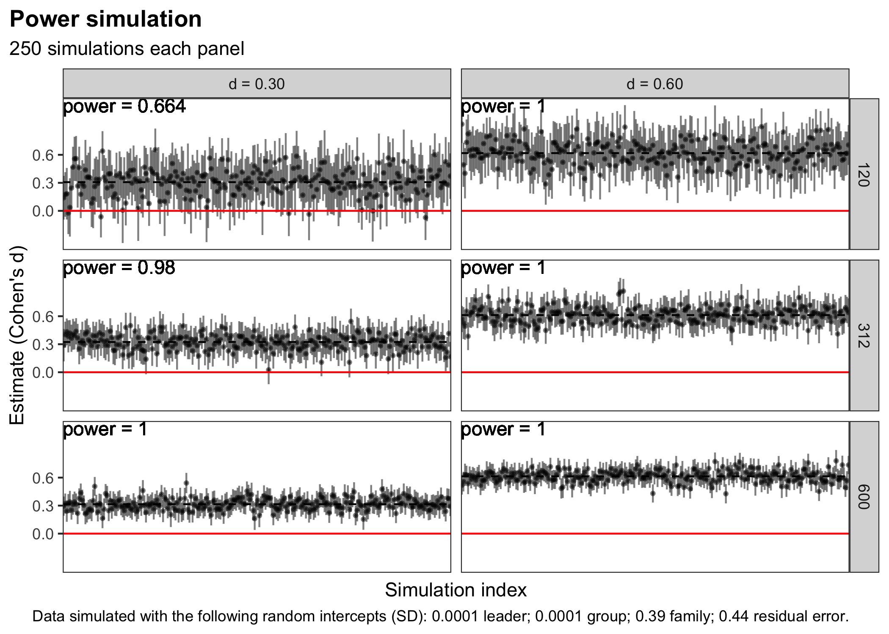

CT Trial Power Simulation
================

# Introduction

In this trial, families will be assigned to a treatment or an inactive
control arm. This is a partially nested design. Families assigned to
treatment will be nested in groups that are assigned to leaders, control
families will not.

\[There might also be nesting of repeated measures (pre/post) for
individuals, but this is not certain.\]

<!-- -->

We will conduct a power simulation similar to what Kurz does in [this
post](https://solomonkurz.netlify.app/post/bayesian-power-analysis-part-i/).

# Function to simulate data

The first step is to create a function to simulate data for this
structure. We’re using the
{[faux](https://debruine.github.io/faux/articles/sim_mixed.html)}
package.

``` r
# load the necessary packages
  library(faux)
  library(tidyverse)
  library(lme4)
  library(broom.mixed)
  library(broom.helpers)
  library(brms)
  library(cmdstanr)
  library(tidybayes)
  library(sjPlot)
```

## How should we set the random effects for simulating data?

Let’s imagine that the dv is a composite scale, specifically the mean of
32 items with possible values of 1 to 5. Thus, the dv can range from 1
to 5. Higher scores represent better family functioning. Let’s also
imagine that we recruit distressed families, so the baseline mean is in
the 2.5-3.5 range.

Eve has some pilot data like this from a single group pre-post study
where families were nested in groups **but there were not multiple
groups per leader**. The families were selected from the target
population, though judging by the baseline means it’s likely that not
all would meet more stringent criteria for need.

    # A tibble: 4 × 4
    # Groups:   caregiver [2]
      caregiver  post  mean    sd
          <dbl> <dbl> <dbl> <dbl>
    1         0     0  4.10 0.652
    2         0     1  3.92 0.701
    3         1     0  4.13 0.625
    4         1     1  4.26 0.641

There was no random effect of group observed in the small pilot:

    # only 1 group per leader in pilot
    # model had convergence issues

    # Fixed Effects 

    Parameter   | Coefficient |   SE |        95% CI | t(81) |      p
    -----------------------------------------------------------------
    (Intercept) |        4.09 | 0.14 | [ 3.82, 4.37] | 29.75 | < .001
    post        |       -0.02 | 0.10 | [-0.22, 0.19] | -0.17 | 0.865 
    caregiver   |        0.11 | 0.13 | [-0.15, 0.38] |  0.85 | 0.396 

    # Random Effects 

    Parameter                                  | Coefficient |       95% CI
    -----------------------------------------------------------------------
    SD (Intercept: member:(family:group))      |        0.28 | [0.00, 0.46]
    SD (Intercept: family:group)               |        0.39 | [0.09, 0.59]
    SD (Intercept: group)                      |        0.00 | [0.00, 0.37]
    SD (Residual)                              |        0.44 | [0.34, 0.52]

``` r
  denom <- sqrt((0.44^2)+(0^2)+(0.39^2)+(0.28^2))
```

These are the values we’ll use in the simulation. With the square root
of the sum of all the variance components equal to 0.65, a Cohen’s
d-like value of 0.30 would be `0.65*0.3 = 0.195`

      b1 <- 0.195        # treatment effect on raw metric
      b0 <- 3.5          # grand mean
      u0l_sd <- 0.0001   # by-leader random intercept SD
      u0g_sd <- 0.0001   # by-group random intercept SD
      u0f_sd <- 0.39     # by-family random intercept SD       
      #u0m_sd <- 0.28    # by-member random intercept SD (ONLY IF REPEATED MEASURES)
      sigma_sd <- 0.44   # residual (error) SD

[DeBruine & Barr](https://osf.io/h2ry6/download):

> If you lack any pilot data to work with, you can start with the
> general rule of thumb setting the residual variance to about twice the
> size of the by-subject or by-item variance components (see
> supplementary materials from Barr et al., 2013 at
> <https://talklab.psy.gla.ac.uk/simgen/realdata.html> for results from
> an informal convenience sample).

## Partial nesting

John shared a paper by [Candlish et
al. (2018)](https://bmcmedresmethodol.biomedcentral.com/articles/10.1186/s12874-018-0559-x)
that simulated the analysis of partially nested RCTs. We take the
approach of coding the partially nested clusters as ‘singleton’ clusters
and fit a partially nested homoscedastic mixed effects model.

John ran the following model in Stata:

    mixed dv treatment || family: || group:treatment, nocons || leader:treatment, nocons reml dfmethod(sat) iterate(100) stddev

The equivalent syntax for lmer is:

    lmer(dv ~ treatment + (0 + treatment | leader/group) + (1 | family))

    Random effects:
    Groups       Name        Std.Dev.
    group:leader treatment   0.0000 
     leader      treatment   0.0000 
     family      (Intercept) 0.3981 
     Residual                0.4066 
    Number of obs: 562, groups:  group:leader, 289; leader, 279; family, 160
    Fixed Effects:
    (Intercept)    treatment 
         3.5299       0.1242 

John provided the following notes:

> The standard deviation of the group random intercept and leader random
> intercept is estimated to be zero, which is in line with what you
> simulated. These random intercepts are only defined in the treatment
> arm (which you can tell from the output since it says “treatment”
> under Name.

> Technically, this is parameterized as a random slope, but we are
> suppressing the separate random intercept. Normally, we would think of
> a slope as being defined on a continuous value (e.g., continuous
> time). Since treatment is a binary variable and we suppress the random
> intercept, it is essentially a random intercept in the treatment arm
> only.

> The standard deviation of the family random intercept is 0.398, which
> is close to what you simulated based on. This random intercept is
> defined in both treatment arms, since we expect there to be clustering
> within family regardless of treatment arm.

> The standard deviation of the individual level variation is 0.41.

## Function

``` r
#' Simulate data
#' @param seed
#' @param action simulate "data only" or "fit" (sim and fit)
#' @param method "lmer" or "brm"
#' @param n_leader number of group leaders (treatment)
#' @param grp_per_lead number of groups per leader
#' @param fam_per_gro_lo number of families per group, low end
#' @param fam_per_gro_hi number of families per group, high end
#' @param mem_per_fam_lo number of members per family, low end
#' @param mem_per_fam_hi number of members per family, high end
#' @param b0 intercept
#' @param b1 fixed effect of treatment
#' @param u0l_sd random intercept SD for leaders
#' @param u0g_sd random intercept SD for groups
#' @param u0f_sd random intercept SD for families
#' @param u0m_sd random intercept SD for members
#' @param sigma_sd error term
#' @param attrition_post_trt post attrition in treatment arm
#' @param attrition_post_ctr post attrition in control arm

  simfit <- function(seed,
                     action = "data only",
                     method = "lmer",
                     n_leader, 
                     grp_per_lead,
                     fam_per_gro_lo,
                     fam_per_gro_hi,
                     mem_per_fam_lo,
                     mem_per_fam_hi,
                     b0,
                     b1,       
                     u0l_sd,   
                     u0g_sd,   
                     u0f_sd,   
                     u0m_sd,   
                     sigma_sd,
                     attrition_post_trt = 0,
                     attrition_post_ctr = 0,
                     ... # helps the function work with pmap() 
                     ) {
    
  set.seed(seed)
    
# calculate nesting parameters --------------------------------------
  n_groups <- (n_leader * grp_per_lead)*2  
    
  if (fam_per_gro_lo==fam_per_gro_hi) {
    n_families_per_group <- fam_per_gro_lo
    n_families <- n_families_per_group * n_groups
  } else {
    n_families_per_group = sample(fam_per_gro_lo:fam_per_gro_hi,
                                  n_groups, replace = T)
    n_families <- sum(n_families_per_group)
  }
    
  if (mem_per_fam_lo==mem_per_fam_hi) {
    n_members_per_family <- mem_per_fam_lo
    n_members <- n_members_per_family * n_families
  } else {
    n_members_per_family = sample(mem_per_fam_lo:mem_per_fam_hi,
                                  n_families, replace = T)
    n_members <- sum(n_members_per_family)
  }
    
# helpers to simulate age
  agerange_caregiver <- list(25:34, 35:44, 45:54, 55:64)
  ageprobs_caregiver <- c(0.35, 0.38, 0.12, 0.05)
  lens_caregiver <- lengths(agerange_caregiver)
  
  agerange_child <- list(8:9, 10:16, 17)
  ageprobs_child <- c(0.15, 0.8, 0.05)
  lens_child <- lengths(agerange_child)
  
# simulate data -----------------------------------------------------
# create structure
  df1 <- add_random(group = n_groups) %>%
    #add_random(leader = n_leader) %>%
    # add_random(group = n_groups_per_leader, 
    #            .nested_in = "leader") %>%
    add_random(family = n_families_per_group, .nested_in = "group") %>%
    add_random(member = n_members_per_family, .nested_in = "family") %>%
    group_by(family) %>%
    mutate(n_members = n()) %>%
    ungroup()
  
# add member details
  df2 <- df1 %>%
  # every family must have at least one child and one caregiver
    nest(data = -family) %>% 
    .[sample(1:nrow(.), nrow(.)), ] %>% # shuffle the group order
    mutate(
      value_count = ifelse(row_number() / n() <= 0.25, 
                           sample(1:2, n(), replace = T), 2)
      ) %>% 
    rowwise() %>% 
    mutate(
      count = nrow(data),
      caregiver = list(sample(c(rep(1, value_count), 
                            rep(0, count - value_count)), count))
      ) %>% 
    unnest(cols=c(caregiver)) %>% 
    arrange(family) %>%
    select(caregiver)
  
  df3 <- df1 %>%
    bind_cols(df2) %>%
    group_by(caregiver) %>%
    nest() %>% 
  # generate ages
    mutate(
      age = map2(data, n_members, ~{
        if (caregiver == 1){
          sample(unlist(agerange_caregiver), 
                 size=nrow(.x), 
                 replace=TRUE, 
                 prob=rep(ageprobs_caregiver/lens_caregiver, 
                          times = lens_caregiver))
          
        } else {
          sample(unlist(agerange_child), 
                 size=nrow(.x), 
                 replace=TRUE, 
                 prob=rep(ageprobs_child/lens_child, 
                          times = lens_child))
        }
      })
    ) %>% 
    unnest(cols=c(data, age)) %>%
    ungroup() %>%
  # create indicator for grandparent
    mutate(grandparent = case_when(
      age > 55 ~ 1,
      TRUE ~ 0
    )) %>% 
  # create indicator for female
    mutate(female = sample(c(0, 1), n(), replace=TRUE)) %>%
  # add treatment assignment
    add_between(.by = "group",
                arm = c("treatment", "control")) %>%
    add_recode("arm", "treatment", control = 0, treatment = 1) %>%
  # create singleton clusters for group 
    group_by(treatment) %>%
    nest() %>% 
    mutate(
        group2 = map2(data, treatment, ~{
            if (treatment == 1){
                .x$group
            } else {
                .x$member
            }
        })
    ) %>% 
    unnest(cols=c(data, group2)) %>%
    ungroup() %>%
    mutate(group = case_when(
      treatment==0 ~ group2,
      TRUE ~ group
    )) %>%
    select(-group2) #%>%
  
# assign groups to leaders
  leader_assignment <- df3 %>% 
    distinct(group) %>%
    mutate(leader = rep(row_number(), length.out = n(), 
                        each = grp_per_lead)) %>%
    mutate(leader = paste0("l", leader))
  
# join back leader assignments and calculate dv
  df <- df3 %>%
    left_join(leader_assignment) %>%
  # create singleton clusters for leader 
    group_by(treatment) %>%
    nest() %>% 
    mutate(
        leader2 = map2(data, treatment, ~{
            if (treatment == 1){
                paste("l0", seq(1:nrow(.)), sep = "_")
            } else {
                .x$member
            }
        })
    ) %>% 
    unnest(cols=c(data, leader2)) %>%
    ungroup() %>%
    mutate(leader = case_when(
      treatment==0 ~ leader2,
      TRUE ~ leader
    )) %>%
    select(-leader2) %>%
    arrange(leader, group, family, member) %>%
  # add random intercepts
    add_ranef("leader", u0l = u0l_sd) %>%
    add_ranef("group", u0g = u0g_sd) %>%
    add_ranef("family", u0f = u0f_sd) %>%
    add_ranef(sigma = sigma_sd) %>%
  # calculate DV
    mutate(dv = b0 + 
                b1*treatment +
                u0l*treatment +   # is 0 for control
                u0g*treatment +   # is 0 for control
                u0f +             # apply family effect to all
                sigma             # apply sigma to all (homoscedastic model)
           ) %>% 
  # attrition
    group_by(treatment) %>%
    nest() %>%
    mutate(p = case_when(
      treatment==1 ~ attrition_post_trt,
      TRUE ~ attrition_post_ctr
    )) %>%
    mutate(data = purrr::map(data, ~ mutate(.x, 
                                            missing = rbinom(n(), 1, p)))) %>% 
    unnest(cols=c(data)) %>%
    ungroup() %>%
    mutate(dv = case_when(
      missing == 1 ~ NA_real_,
      TRUE ~ dv
    )) %>%
  # finalize
    select(member, family, treatment, group, leader,
           age, female, caregiver, grandparent, 
           dv) %>%
    arrange(family)
  
# fit ---------------------------------------------------------------
  
  if (action == "fit"){
    
  set.seed(seed)
  
  # number of families
    families <- df %>% 
      distinct(family) %>%
      count() %>% 
      pull()
    
  # fit by method
    if (method == "lmer") {
      
      fit <- lmer(dv ~ treatment + age + female + caregiver +
                    (0 + treatment | leader/group) + 
                    (1 | family), 
                  data=df)
  
      res <- broom.mixed::tidy(fit, conf.int = TRUE) %>%
        mutate(type = "raw")
      
      sqrt_sum_var <- res %>%
        filter(effect=="ran_pars") %>%
        mutate(estimate = estimate^2) %>%
        summarize(sqrt_sum_var = sqrt(sum(estimate))) %>%
        pull(sqrt_sum_var)
      
      res <- res %>%
        filter(effect=="fixed") %>%
        filter(term != "(Intercept)") %>%
        mutate(estimate = estimate/sqrt_sum_var,
               conf.low = conf.low/sqrt_sum_var,
               conf.high = conf.high/sqrt_sum_var,
               type = "d_t") %>%
        bind_rows(res) %>%
        mutate(families = families)
  
    } else if (method == "brm") {
      
      fit <- brm(dv ~ 0 + Intercept + 
                   treatment + age + female + caregiver + 
                   (0 + treatment | leader/group) + 
                   (1 | family),
         # prior = c(prior(normal(0, 2), class = b),
         #           prior(student_t(3, 1, 1), class = sigma)),
                 data = df, 
                 control = list(adapt_delta = 0.9),
                 cores = parallel::detectCores(),
                 backend = "cmdstanr")
      
      res <- tidy_plus_plus(fit, quiet = TRUE) %>%
        mutate(type = "raw")
    
      res_d_t <- fit %>%
        posterior_samples(pars = c("^b_", "sd_", "sigma")) %>%
        mutate(across(c(starts_with("sd_"), sigma), ~ . ^2)) %>%
        mutate(sqrt_sum_var = sqrt(rowSums(select(., 
                                                  c(starts_with("sd_"),
                                                    sigma))))) %>%
        mutate(across(c(starts_with("b_")), ~ . / sqrt_sum_var)) %>%
        summarise_draws() %>% 
        filter(str_detect(variable, "b_")) %>%
        mutate(variable = gsub("b_", "", variable)) %>%
        select(variable, mean, q5, q95) %>%
        rename(term = variable,
               estimate = mean, 
               conf.low = q5,
               conf.high = q95) %>%
        mutate(type = "d_t") %>%
        filter(term != "Intercept")
      
      res <- res %>%
        bind_rows(res_d_t) %>%
        mutate(families = families)
    }
    
  } else {
      return(df)
    }
  }
```

# Full simulations

## Data

Example data structure:

``` r
  b1 <- 0.195          # treatment effect on raw metric
  b0 <- 3.5            # grand mean
  u0l_sd <- 0.0001     # by-leader random intercept SD
  u0g_sd <- 0.0001     # by-group random intercept SD
  u0f_sd <- 0.39       # by-family random intercept SD       
  #u0m_sd <- 0.28      # by-member random intercept SD
  sigma_sd <- 0.44     # residual (error) SD
  n_leader <- 10        # number of leaders (treatment)
  grp_per_lead <- 2    # groups per leader (treatment)
  fam_per_gro_lo <- 4; fam_per_gro_hi <- 4  # families per group
  mem_per_fam_lo <- 2; mem_per_fam_hi <- 5  # members per family
```

    ## # A tibble: 562 × 10
    ##    member family group leader treatment    dv   age female caregiver grandparent
    ##    <chr>  <chr>  <chr> <chr>      <dbl> <dbl> <dbl>  <dbl>     <dbl>       <dbl>
    ##  1 m001   f001   g01   l1             1  4.17    42      0         1           0
    ##  2 m002   f001   g01   l1             1  3.18    14      1         0           0
    ##  3 m003   f001   g01   l1             1  3.00     9      0         0           0
    ##  4 m004   f001   g01   l1             1  4.13    16      1         0           0
    ##  5 m005   f001   g01   l1             1  3.25    15      1         0           0
    ##  6 m006   f002   g01   l1             1  3.49    11      0         0           0
    ##  7 m007   f002   g01   l1             1  3.52    37      0         1           0
    ##  8 m008   f002   g01   l1             1  2.87     9      0         0           0
    ##  9 m009   f002   g01   l1             1  3.02    48      1         1           0
    ## 10 m010   f003   g01   l1             1  3.37    13      0         0           0
    ## 11 m011   f003   g01   l1             1  3.66    43      0         1           0
    ## 12 m012   f003   g01   l1             1  3.60    49      0         1           0
    ## 13 m013   f004   g01   l1             1  3.43    41      0         1           0
    ## 14 m014   f004   g01   l1             1  3.47    35      1         1           0
    ## 15 m015   f004   g01   l1             1  3.15    10      0         0           0
    ## 16 m016   f004   g01   l1             1  3.71    14      0         0           0
    ## # … with 546 more rows

## `lme4`

The first approach is in the NHST tradition and calculates the
percentage of simulated 95% confidence intervals are above 0.

### Effect size by sample size

``` r
  x <- crossing(
    # number of simulations per combination
      rep = 1:250,
    # SAMPLE SIZE DETERMINATION -------------
    # number of leaders 
      n_leader = c(5, 8), 
    # groups per leader
      grp_per_lead = 3,
    # families per group
      fam_per_gro_lo = 4, fam_per_gro_hi = 4,
    # members per family
      mem_per_fam_lo = 2, mem_per_fam_hi = 5,
    # MODEL ----------------------------------
    # effect
      b1 = c(0.195, .39), # cohens d ~ 0.3, 0.6
      b0 = b0,             
      u0l_sd = u0l_sd,   
      u0g_sd = u0g_sd,   
      u0f_sd = u0f_sd,       
      #u0m_sd = u0m_sd,
      sigma_sd = sigma_sd
  ) %>%
    mutate(seed = 1:nrow(.),
           action = "fit",
           method = "lmer"
           ) %>%
    mutate(analysis = pmap(., simfit)) %>%
    unnest(analysis)
```

Small effects will be difficult to detect with anything less than 600
families if the pilot data are any guide. With only \~120 families the
effects would need to be in the 0.60 SD range.

<!-- -->

# Next steps

1.  Add Bayesian estimates to focus on precision. If Eve can’t fund a
    “definitive” trial (I dislike that term), then I’m interested in
    getting a better sense of what we could learn with a sample of say
    75 or 80 families. Thinking about 53% credible intervals (to blend
    McElreath’s love of prime numbers to highlight arbitrary nature of
    interval selection and Gelman’s love of 50% intervals).
2.  Talk about how to analyze data from multiple informants. The current
    setup uses data from all family members as if we’re estimating the
    average impact on a person’s perceived functioning of their family.
    But we can also think of family functioning of something that exists
    at the level of the family. [Kenny has some
    notes](https://academic.oup.com/jpepsy/article/36/5/630/924908)
    about approaches.
