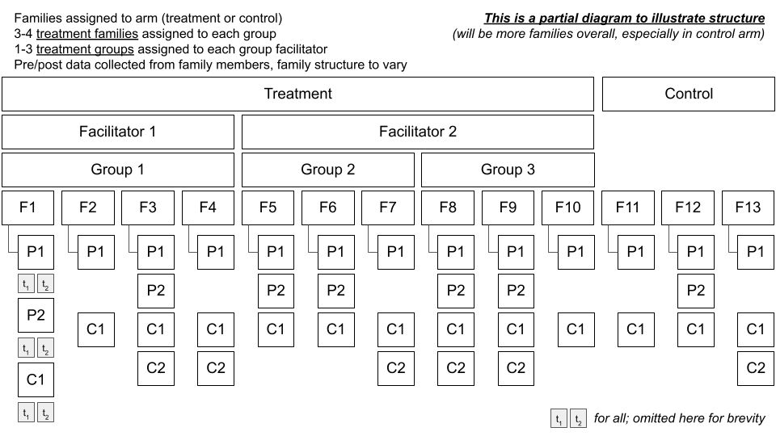

CT Trial Power Simulation
================

# Introduction

In this trial, families will be assigned to a treatment or an inactive
control arm. Families assigned to treatment will be nested in groups
that are assigned to facilitators. Data will be collected from all
eligible family members before (?) and after the intervention is
delivered to families assigned to the treatment arm.

<!-- -->

# Approach

We will conduct a Bayesian power simulation similar to what Kurz does in
[this
post](https://solomonkurz.netlify.app/post/bayesian-power-analysis-part-i/).

## Function to simulate data

The first step is to create a function to simulate data for this
structure. We’re using the
{[faux](https://debruine.github.io/faux/articles/sim_mixed.html)}
package.

``` r
# load the necessary packages
  library(faux)
  library(tidyverse)
  library(lme4)
  library(broom.mixed)
  library(broom.helpers)
  library(brms)
  library(cmdstanr)
  library(tidybayes)
  library(sjPlot)
```

I’m unsure about:

1.  Setting group and facilitator columns to 0 for control arms
2.  Setting group/facilitator random effects to 0 for control arms
3.  Setting group/facilitator random effects to 0 for pre observations
4.  Omitting random slopes
5.  Calculating dv: see `(b1 * treatment * post)`

``` r
#' Simulate data
#' @param seed  simulation seed
#' @param n_facilitator number of group facilitators
#' @param grp_per_fac_lo number of groups per facilitator, low end
#' @param grp_per_fac_hi number of groups per facilitator, high end
#' @param fam_per_gro_lo number of families per group, low end
#' @param fam_per_gro_hi number of families per group, high end
#' @param mem_per_fam_lo number of members per family, low end
#' @param mem_per_fam_hi number of members per family, high end
#' @param b0 intercept
#' @param b1 fixed effect of arm
#' @param u0l_sd random intercept SD for facilitators
#' @param u0g_sd random intercept SD for groups
#' @param u0f_sd random intercept SD for families
#' @param u0m_sd random intercept SD for members
#' @param sigma_sd error term
#' @param attrition_post_trt post attrition in treatment arm
#' @param attrition_post_ctr post attrition in control arm

  sim <- function(n_facilitator, 
                  grp_per_fac_lo,
                  grp_per_fac_hi,
                  fam_per_gro_lo,
                  fam_per_gro_hi,
                  mem_per_fam_lo,
                  mem_per_fam_hi,
                  b0 = 0,
                  b1 = 0,       
                  u0l_sd = 0,   
                  u0g_sd = 0,   
                  u0f_sd = 0,   
                  u0m_sd = 0,   
                  sigma_sd = 0,
                  attrition_post_trt = 0,
                  attrition_post_ctr = 0,
                  ... # helps the function work with pmap() 
                  ) {
    
# calculate nesting parameters
# this is ugly because I'm leaving it open that parameters could be fixed
# or could vary
  if (grp_per_fac_lo==grp_per_fac_hi) {
    n_groups_per_facilitator <- grp_per_fac_lo
    n_groups <- n_groups_per_facilitator * n_facilitator
  } else {
    n_groups_per_facilitator = sample(grp_per_fac_lo:grp_per_fac_hi, 
                                      n_facilitator, replace = TRUE)
    n_groups <- sum(n_groups_per_facilitator)
  }
    
  if (fam_per_gro_lo==fam_per_gro_hi) {
    n_families_per_group <- fam_per_gro_lo
    n_families <- n_families_per_group * n_groups
  } else {
    n_families_per_group = sample(fam_per_gro_lo:fam_per_gro_hi,
                                  n_groups, replace = T)
    n_families <- sum(n_families_per_group)
  }
    
  if (mem_per_fam_lo==mem_per_fam_hi) {
    n_members_per_family <- mem_per_fam_lo
    n_members <- n_members_per_family * n_families
  } else {
    n_members_per_family = sample(mem_per_fam_lo:mem_per_fam_hi,
                                  n_families, replace = T)
    n_members <- sum(n_members_per_family)
  }
  
# simulate data
  df <- add_random(facilitator = n_facilitator) %>%
    add_random(group = n_groups_per_facilitator, 
               .nested_in = "facilitator") %>%
    add_random(family = n_families_per_group, .nested_in = "group") %>%
    add_random(member = n_members_per_family, .nested_in = "family") %>%
    add_within("member", time = c("pre", "post")) %>%
    add_between(.by = "group",
                arm = c("treatment", "control")) %>%
    add_recode("arm", "treatment", control = 0, treatment = 1) %>%
    add_recode("time", "post", pre = 0, post = 1) %>%
  # remove group/facilitator nesting for control arm
    mutate(facilitator = as.numeric(gsub("f", "", facilitator)),
           facilitator = case_when(
             arm == "control" ~ 0,
             TRUE ~ facilitator
    )) %>%
    mutate(group = as.numeric(gsub("g", "", group)),
           group = case_when(
             arm == "control" ~ 0,
             TRUE ~ group
    )) %>%
    mutate(family = as.numeric(gsub("f", "", family)),
           member = as.numeric(gsub("m", "", member))
           ) %>%
  # add random intercepts
    add_ranef("facilitator", u0l = u0l_sd) %>%
    add_ranef("group", u0g = u0g_sd) %>%
    add_ranef("family", u0f = u0f_sd) %>%
    add_ranef("member", u0m = u0m_sd) %>%
    add_ranef(sigma = sigma_sd) %>%
  # set group/facilitator random effects to 0 for control
    mutate(across(c(u0l, u0g), ~ case_when(arm == "control" ~ 0, 
                                           TRUE ~ .x))) %>%
  # set group/facilitator random effects to 0 for pre
    mutate(across(c(u0l, u0g), ~ case_when(time == "pre" ~ 0, 
                                           TRUE ~ .x))) %>%
  # TEMPORARY: Limit to 1 member per family
    distinct(family, time, .keep_all = TRUE) %>%
  # calculate DV
    mutate(dv = b0 + u0l + u0g + u0f + u0m +  
             (b1 * treatment * post) + sigma) %>%
  # reshape
    select(member, time, family, treatment, group, facilitator, dv) %>%
    pivot_wider(id_cols = c(member, family, treatment, group, facilitator),
                names_from = time,
                values_from = dv) %>%
  # scale
    # mutate(pre = scale(pre),
    #        post = scale(post)) %>%
    rename(y_pre = pre,
           y_post = post) %>%
  # attrition
  # TODO NOT SET UP FOR MULTIPLE FAMILY MEMBERS
    group_by(treatment) %>%
    nest() %>%
    mutate(p = case_when(
      treatment==1 ~ attrition_post_trt,
      TRUE ~ attrition_post_ctr
    )) %>%
    mutate(data = purrr::map(data, ~ mutate(.x, 
                                            missing = rbinom(n(), 1, p)))) %>% 
    unnest() %>%
    ungroup() %>%
    mutate(y_post = case_when(
      missing == 1 ~ NA_real_,
      TRUE ~ y_post
    )) %>%
    select(-p, -missing)
  }
```

## How should we set the random effects for simulating data?

-   Time (pre/post) is nested in family members
-   Family members are nested in families
-   Families are nested in groups (only relevant for post data for the
    families in the treatment arm)
-   Groups are nested in facilitators (only relevant for post data for
    the families in the treatment arm)

``` r
  b1 <- 0.31         # treatment effect on raw metric
  b0 <- 2            # grand mean
  b1 <- 0.31         # treatment effect on raw metric
  u0l_sd <- 0.0425   # by-facilitator random intercept SD
  u0g_sd <- 0.085    # by-group random intercept SD
  u0f_sd <- 0.17     # by-family random intercept SD       
  u0m_sd <- 0.34     # by-member random intercept SD
  sigma_sd <- 0.68   # residual (error) SD
```

[DeBruine & Barr](https://osf.io/h2ry6/download):

> If you lack any pilot data to work with, you can start with the
> general rule of thumb setting the residual variance to about twice the
> size of the by-subject or by-item variance components (see
> supplementary materials from Barr et al., 2013 at
> <https://talklab.psy.gla.ac.uk/simgen/realdata.html> for results from
> an informal convenience sample).

## Check the function

Let’s imagine that the dv is a composite scale, specifically the mean of
32 items with possible values of 1 to 5. Thus, the dv can range from 1
to 5. Higher scores represent better family functioning. Let’s also
imagine that we recruit distressed families, so the baseline mean is 2

I’m unsure about:

1.  How to set the random effects (I think family and member should
    remain 0 because we’re only dealing with 1 member per household at
    the moment)
2.  Does this look right?

``` r
  set.seed(8675309)
  df <- sim(# number of facilitators
             n_facilitator = 10, 
            # assume facilitators have 4 groups
             grp_per_fac_lo = 4, grp_per_fac_hi = 4,
            # assume groups have 4 families
              fam_per_gro_lo = 4, fam_per_gro_hi = 4,
            # assume families have 2-5 members
              mem_per_fam_lo = 2, mem_per_fam_hi = 5,
            # model parameters
              b0 = b0,             
              b1 = b1,          
              u0l_sd = u0l_sd,   
              u0g_sd = u0g_sd,   
              u0f_sd = u0f_sd,       
             #u0m_sd = u0m_sd,  # TEMP set to 0 by default   
              sigma_sd = sigma_sd)
```

The function initially sets up to have members nested within families,
but we drop to just 1 member/family before simulating data.

``` r
# look at the data
  df
```

    ## # A tibble: 160 × 7
    ##    treatment member family group facilitator y_pre y_post
    ##        <dbl>  <dbl>  <dbl> <dbl>       <dbl> <dbl>  <dbl>
    ##  1         1      1      1     1           1  1.21   3.25
    ##  2         1      6      2     1           1  2.83   3.54
    ##  3         1     10      3     1           1  1.65   1.52
    ##  4         1     13      4     1           1  2.76   2.60
    ##  5         1     30      9     3           1  1.90   1.34
    ##  6         1     33     10     3           1  2.43   3.00
    ##  7         1     37     11     3           1  1.67   2.22
    ##  8         1     41     12     3           1  1.90   2.67
    ##  9         1     56     17     5           2  2.21   3.72
    ## 10         1     61     18     5           2  1.07   2.08
    ## # … with 150 more rows

``` r
# families per arm
  df %>% count(treatment)
```

    ## # A tibble: 2 × 2
    ##   treatment     n
    ##       <dbl> <int>
    ## 1         0    80
    ## 2         1    80

Note: If there are varying numbers of families per group, there will not
be a 1:1 allocation of families to arm.

``` r
  m <- brm(y_post ~ 0 + Intercept + treatment + y_pre + 
               (1 | facilitator/group),
             # prior = c(prior(normal(0, 2), class = b),
             #           prior(student_t(3, 1, 1), class = sigma)),
             data = df, 
             control = list(adapt_delta = 0.9),
             cores = parallel::detectCores())
```

``` r
  tab_model(m)
```

<table style="border-collapse:collapse; border:none;">
<tr>
<th style="border-top: double; text-align:center; font-style:normal; font-weight:bold; padding:0.2cm;  text-align:left; ">
 
</th>
<th colspan="2" style="border-top: double; text-align:center; font-style:normal; font-weight:bold; padding:0.2cm; ">
y post
</th>
</tr>
<tr>
<td style=" text-align:center; border-bottom:1px solid; font-style:italic; font-weight:normal;  text-align:left; ">
Predictors
</td>
<td style=" text-align:center; border-bottom:1px solid; font-style:italic; font-weight:normal;  ">
Estimates
</td>
<td style=" text-align:center; border-bottom:1px solid; font-style:italic; font-weight:normal;  ">
CI (95%)
</td>
</tr>
<tr>
<td style=" padding:0.2cm; text-align:left; vertical-align:top; text-align:left; ">
Intercept
</td>
<td style=" padding:0.2cm; text-align:left; vertical-align:top; text-align:center;  ">
1.73
</td>
<td style=" padding:0.2cm; text-align:left; vertical-align:top; text-align:center;  ">
0.79 – 2.67
</td>
</tr>
<tr>
<td style=" padding:0.2cm; text-align:left; vertical-align:top; text-align:left; ">
treatment
</td>
<td style=" padding:0.2cm; text-align:left; vertical-align:top; text-align:center;  ">
0.37
</td>
<td style=" padding:0.2cm; text-align:left; vertical-align:top; text-align:center;  ">
-0.47 – 1.30
</td>
</tr>
<tr>
<td style=" padding:0.2cm; text-align:left; vertical-align:top; text-align:left; ">
y pre
</td>
<td style=" padding:0.2cm; text-align:left; vertical-align:top; text-align:center;  ">
0.11
</td>
<td style=" padding:0.2cm; text-align:left; vertical-align:top; text-align:center;  ">
-0.05 – 0.29
</td>
</tr>
<tr>
<td colspan="3" style="font-weight:bold; text-align:left; padding-top:.8em;">
Random Effects
</td>
</tr>
<tr>
<td style=" padding:0.2cm; text-align:left; vertical-align:top; text-align:left; padding-top:0.1cm; padding-bottom:0.1cm;">
σ<sup>2</sup>
</td>
<td style=" padding:0.2cm; text-align:left; vertical-align:top; padding-top:0.1cm; padding-bottom:0.1cm; text-align:left;" colspan="2">
0.56
</td>
<tr>
<td style=" padding:0.2cm; text-align:left; vertical-align:top; text-align:left; padding-top:0.1cm; padding-bottom:0.1cm;">
τ<sub>00</sub> <sub>facilitator</sub>
</td>
<td style=" padding:0.2cm; text-align:left; vertical-align:top; padding-top:0.1cm; padding-bottom:0.1cm; text-align:left;" colspan="2">
0.06
</td>
<tr>
<td style=" padding:0.2cm; text-align:left; vertical-align:top; text-align:left; padding-top:0.1cm; padding-bottom:0.1cm;">
τ<sub>00</sub> <sub>facilitator:group</sub>
</td>
<td style=" padding:0.2cm; text-align:left; vertical-align:top; padding-top:0.1cm; padding-bottom:0.1cm; text-align:left;" colspan="2">
0.05
</td>
<tr>
<td style=" padding:0.2cm; text-align:left; vertical-align:top; text-align:left; padding-top:0.1cm; padding-bottom:0.1cm;">
ICC
</td>
<td style=" padding:0.2cm; text-align:left; vertical-align:top; padding-top:0.1cm; padding-bottom:0.1cm; text-align:left;" colspan="2">
0.17
</td>
<tr>
<td style=" padding:0.2cm; text-align:left; vertical-align:top; text-align:left; padding-top:0.1cm; padding-bottom:0.1cm;">
N <sub>group</sub>
</td>
<td style=" padding:0.2cm; text-align:left; vertical-align:top; padding-top:0.1cm; padding-bottom:0.1cm; text-align:left;" colspan="2">
21
</td>
<tr>
<td style=" padding:0.2cm; text-align:left; vertical-align:top; text-align:left; padding-top:0.1cm; padding-bottom:0.1cm;">
N <sub>facilitator</sub>
</td>
<td style=" padding:0.2cm; text-align:left; vertical-align:top; padding-top:0.1cm; padding-bottom:0.1cm; text-align:left;" colspan="2">
11
</td>
<tr>
<td style=" padding:0.2cm; text-align:left; vertical-align:top; text-align:left; padding-top:0.1cm; padding-bottom:0.1cm; border-top:1px solid;">
Observations
</td>
<td style=" padding:0.2cm; text-align:left; vertical-align:top; padding-top:0.1cm; padding-bottom:0.1cm; text-align:left; border-top:1px solid;" colspan="2">
160
</td>
</tr>
<tr>
<td style=" padding:0.2cm; text-align:left; vertical-align:top; text-align:left; padding-top:0.1cm; padding-bottom:0.1cm;">
Marginal R<sup>2</sup> / Conditional R<sup>2</sup>
</td>
<td style=" padding:0.2cm; text-align:left; vertical-align:top; padding-top:0.1cm; padding-bottom:0.1cm; text-align:left;" colspan="2">
0.085 / 0.159
</td>
</tr>
</table>

The `lmer()` approach:

``` r
  m2 <- lmer(y_post ~ treatment + y_pre + 
               (1 | facilitator/group),
             data = df)
  
  m2
```

    ## Linear mixed model fit by REML ['lmerMod']
    ## Formula: y_post ~ treatment + y_pre + (1 | facilitator/group)
    ##    Data: df
    ## REML criterion at convergence: 372.4413
    ## Random effects:
    ##  Groups            Name        Std.Dev.
    ##  group:facilitator (Intercept) 0.1851  
    ##  facilitator       (Intercept) 0.2250  
    ##  Residual                      0.7397  
    ## Number of obs: 160, groups:  group:facilitator, 21; facilitator, 11
    ## Fixed Effects:
    ## (Intercept)    treatment        y_pre  
    ##      1.7251       0.3717       0.1178

``` r
  broom.mixed::tidy(m2) %>%
    mutate(term = case_when(
      effect=="ran_pars" ~ paste(group, term),
      TRUE ~ term
    )) %>%
    mutate(starting_value = c(b0, b1, NA, u0g_sd, u0l_sd, sigma_sd)) %>%
    select(term, estimate, starting_value)
```

    ## # A tibble: 6 × 3
    ##   term                              estimate starting_value
    ##   <chr>                                <dbl>          <dbl>
    ## 1 (Intercept)                          1.73          2     
    ## 2 treatment                            0.372         0.31  
    ## 3 y_pre                                0.118        NA     
    ## 4 group:facilitator sd__(Intercept)    0.185         0.085 
    ## 5 facilitator sd__(Intercept)          0.225         0.0425
    ## 6 Residual sd__Observation             0.740         0.68

## Full simulation

Create a new function that simulates the data and fits the model.

``` r
#' Simulate data
#' @param seed  simulation seed
#' @param n_facilitator number of group facilitators
#' @param grp_per_fac_lo number of groups per facilitator, low end
#' @param grp_per_fac_hi number of groups per facilitator, high end
#' @param fam_per_gro_lo number of families per group, low end
#' @param fam_per_gro_hi number of families per group, high end
#' @param mem_per_fam_lo number of members per family, low end
#' @param mem_per_fam_hi number of members per family, high end
#' @param b0 intercept
#' @param b1 fixed effect of arm
#' @param u0l_sd random intercept SD for facilitators
#' @param u0g_sd random intercept SD for groups
#' @param u0f_sd random intercept SD for families
#' @param u0m_sd random intercept SD for members
#' @param sigma_sd error term
#' @param attrition_post_trt post attrition in treatment arm
#' @param attrition_post_ctr post attrition in control arm

  simfit <- function(n_facilitator, 
                     grp_per_fac_lo,
                     grp_per_fac_hi,
                     fam_per_gro_lo,
                     fam_per_gro_hi,
                     mem_per_fam_lo,
                     mem_per_fam_hi,
                     b0 = 0,
                     b1 = 0,       
                     u0l_sd = 0,   
                     u0g_sd = 0,   
                     u0f_sd = 0,   
                     u0m_sd = 0,   
                     u0t_sd = 0,   
                     sigma_sd = 0,
                     attrition_post_trt = 0,
                     attrition_post_ctr = 0,
                     ... # helps the function work with pmap() 
                     ) {
    
# calculate nesting parameters
# this is ugly because I'm leaving it open that parameters could be fixed
# or could vary
  if (grp_per_fac_lo==grp_per_fac_hi) {
    n_groups_per_facilitator <- grp_per_fac_lo
    n_groups <- n_groups_per_facilitator * n_facilitator
  } else {
    n_groups_per_facilitator = sample(grp_per_fac_lo:grp_per_fac_hi, 
                                      n_facilitator, replace = TRUE)
    n_groups <- sum(n_groups_per_facilitator)
  }
    
  if (fam_per_gro_lo==fam_per_gro_hi) {
    n_families_per_group <- fam_per_gro_lo
    n_families <- n_families_per_group * n_groups
  } else {
    n_families_per_group = sample(fam_per_gro_lo:fam_per_gro_hi,
                                  n_groups, replace = T)
    n_families <- sum(n_families_per_group)
  }
    
  if (mem_per_fam_lo==mem_per_fam_hi) {
    n_members_per_family <- mem_per_fam_lo
    n_members <- n_members_per_family * n_families
  } else {
    n_members_per_family = sample(mem_per_fam_lo:mem_per_fam_hi,
                                  n_families, replace = T)
    n_members <- sum(n_members_per_family)
  }
  
# simulate data
  df <- add_random(facilitator = n_facilitator) %>%
    add_random(group = n_groups_per_facilitator, 
               .nested_in = "facilitator") %>%
    add_random(family = n_families_per_group, .nested_in = "group") %>%
    add_random(member = n_members_per_family, .nested_in = "family") %>%
    add_within("member", time = c("pre", "post")) %>%
    add_between(.by = "group",
                arm = c("treatment", "control")) %>%
    add_recode("arm", "treatment", control = 0, treatment = 1) %>%
    add_recode("time", "post", pre = 0, post = 1) %>%
  # remove group/facilitator nesting for control arm
    mutate(facilitator = as.numeric(gsub("f", "", facilitator)),
           facilitator = case_when(
             arm == "control" ~ 0,
             TRUE ~ facilitator
    )) %>%
    mutate(group = as.numeric(gsub("g", "", group)),
           group = case_when(
             arm == "control" ~ 0,
             TRUE ~ group
    )) %>%
    mutate(family = as.numeric(gsub("f", "", family)),
           member = as.numeric(gsub("m", "", member))
           ) %>%
  # add random intercepts
    add_ranef("facilitator", u0l = u0l_sd) %>%
    add_ranef("group", u0g = u0g_sd) %>%
    add_ranef("family", u0f = u0f_sd) %>%
    add_ranef("member", u0m = u0m_sd) %>%
    add_ranef(sigma = sigma_sd) %>%
  # set group/facilitator random effects to 0 for control
    mutate(across(c(u0l, u0g), ~ case_when(arm == "control" ~ 0, 
                                           TRUE ~ .x))) %>%
  # TEMPORARY: Limit to 1 member per family
    distinct(family, time, .keep_all = TRUE) %>%
  # calculate DV
    mutate(dv = b0 + u0l + u0g + u0f + u0m + 
             (b1 * treatment * post) + sigma) %>%
  # reshape
    select(member, time, family, treatment, group, facilitator, dv) %>%
    pivot_wider(id_cols = c(member, family, treatment, group, facilitator),
                names_from = time,
                values_from = dv) %>%
  # scale
    # mutate(pre = scale(pre),
    #        post = scale(post)) %>%
    rename(y_pre = pre,
           y_post = post) %>%
  # attrition
  # TODO NOT SET UP FOR MULTIPLE FAMILY MEMBERS
    group_by(treatment) %>%
    nest() %>%
    mutate(p = case_when(
      treatment==1 ~ attrition_post_trt,
      TRUE ~ attrition_post_ctr
    )) %>%
    mutate(data = purrr::map(data, ~ mutate(.x, 
                                            missing = rbinom(n(), 1, p)))) %>% 
    unnest() %>%
    ungroup() %>%
    mutate(y_post = case_when(
      missing == 1 ~ NA_real_,
      TRUE ~ y_post
    )) %>%
    select(-p, -missing)
  
# fit <- brm(y_post ~ 0 + Intercept + treatment + y_pre +
#              (1 | facilitator/group),
#            prior = c(prior(normal(0, 2), class = b),
#                      prior(student_t(3, 1, 1), class = sigma)),
#            data = df,
#            control = list(adapt_delta = 0.9),
#            cores = parallel::detectCores())

# TODO: figure out how to get seed from x
  fit <- update(m,
                newdata = df)
  
  #broom.mixed::tidy(fit)
  tidy_plus_plus(fit)
  }
```

It’s time to simulate with different combinations of scenarios and
parameters. Just doing 10 runs and only varying number of facilitators
(a key driver of sample size in this setup) to test.

``` r
  x <- crossing(
    # number of replicates
      rep = 1:10,
    # REMAINING CAN BE FIXED (ONE VALUE) OR A RANGE ------------------
    # number of facilitators
      n_facilitator = c(10, 30), 
    # assume facilitators have 4 groups
      grp_per_fac_lo = 4, grp_per_fac_hi = 4,
    # assume groups have 4 families
      fam_per_gro_lo = 4, fam_per_gro_hi = 4,
    # assume families have 2-5 members
      mem_per_fam_lo = 2, mem_per_fam_hi = 5,
    # model parameters
      b0 = b0,             
      b1 = b1,          
      u0l_sd = u0l_sd,   
      u0g_sd = u0g_sd,   
      u0f_sd = u0f_sd,       
     #u0m_sd = u0m_sd,  # TEMP set to 0 by default   
      sigma_sd = sigma_sd
  ) %>%
    mutate(analysis = pmap(., simfit)) %>%
    unnest(analysis)
```

``` r
  x %>% 
    filter(term=="treatment")
```

    ## # A tibble: 20 × 33
    ##      rep n_facilitator grp_per_fac_lo grp_per_fac_hi fam_per_gro_lo
    ##    <int>         <dbl>          <dbl>          <dbl>          <dbl>
    ##  1     1            10              4              4              4
    ##  2     1            30              4              4              4
    ##  3     2            10              4              4              4
    ##  4     2            30              4              4              4
    ##  5     3            10              4              4              4
    ##  6     3            30              4              4              4
    ##  7     4            10              4              4              4
    ##  8     4            30              4              4              4
    ##  9     5            10              4              4              4
    ## 10     5            30              4              4              4
    ## 11     6            10              4              4              4
    ## 12     6            30              4              4              4
    ## 13     7            10              4              4              4
    ## 14     7            30              4              4              4
    ## 15     8            10              4              4              4
    ## 16     8            30              4              4              4
    ## 17     9            10              4              4              4
    ## 18     9            30              4              4              4
    ## 19    10            10              4              4              4
    ## 20    10            30              4              4              4
    ## # … with 28 more variables: fam_per_gro_hi <dbl>, mem_per_fam_lo <dbl>,
    ## #   mem_per_fam_hi <dbl>, b0 <dbl>, b1 <dbl>, u0l_sd <dbl>, u0g_sd <dbl>,
    ## #   u0f_sd <dbl>, sigma_sd <dbl>, term <chr>, original_term <chr>,
    ## #   variable <chr>, var_label <chr>, var_class <int>, var_type <chr>,
    ## #   var_nlevels <int>, contrasts <chr>, contrasts_type <chr>,
    ## #   reference_row <lgl>, label <chr>, n_obs <dbl>, effect <chr>,
    ## #   component <chr>, group <chr>, estimate <dbl>, std.error <dbl>, …

``` r
  x %>% 
    filter(term=="treatment") %>%
    mutate(n_families = paste0(n_obs, " families")) %>%
    ggplot(aes(x = factor(rep), y = estimate, 
               ymin = conf.low, ymax = conf.high)) +
      geom_pointrange(fatten = 1/4, alpha=0.7) +
      geom_hline(yintercept = b1, linetype="dashed") +
      geom_hline(yintercept = 0, color = "red") +
      facet_wrap(~ n_families) +
      theme_bw() + 
      theme(plot.title = element_text(face="bold"),
            plot.title.position = "plot",
            legend.position = "none") +
      labs(x = "Simulation index",
           y = "Estimate (original 1-5 metric)",
           title = "Power simulation",
           subtitle = str_wrap("X number of simulations...", 100),
           caption = str_wrap("Simulations assume...", 120)
           )
```

<!-- -->

# Next steps

1.  Priors!
2.  Attrition! (added but only for the 1 member/family scenario)
3.  Finish setting up simulation to estimate power (including variants
    for effect size, random effects, families, etc)
4.  Talk about how to analyze data from multiple informants
