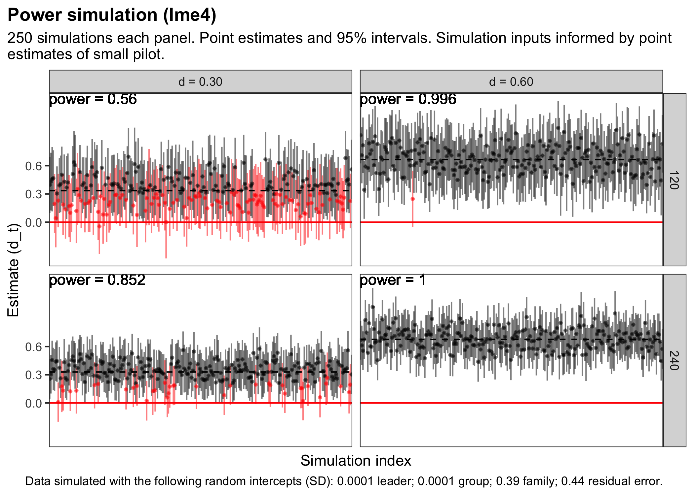
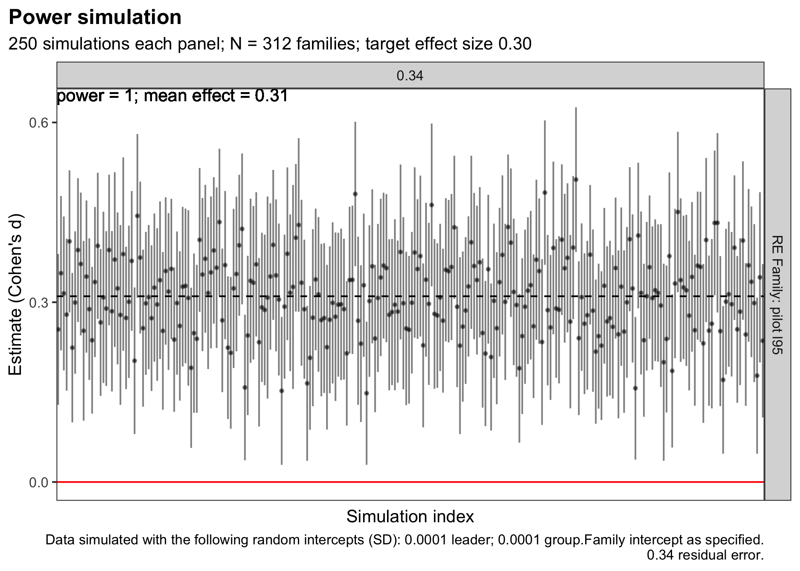

CT Trial Power Simulation
================

# Introduction

In this trial, families will be assigned to a treatment or an inactive
control arm. Families assigned to treatment will be nested in groups
that are assigned to leaders. Data will be collected from all eligible
family members before (?) and after the intervention is delivered to
families assigned to the treatment arm.

<!-- -->

We will conduct a power simulation similar to what Kurz does in [this
post](https://solomonkurz.netlify.app/post/bayesian-power-analysis-part-i/).

# Function to simulate data

The first step is to create a function to simulate data for this
structure. We’re using the
{[faux](https://debruine.github.io/faux/articles/sim_mixed.html)}
package.

``` r
# load the necessary packages
  library(faux)
  library(tidyverse)
  library(lme4)
  library(broom.mixed)
  library(broom.helpers)
  library(brms)
  library(cmdstanr)
  library(tidybayes)
  library(sjPlot)
```

## How should we set the random effects for simulating data?

Let’s imagine that the dv is a composite scale, specifically the mean of
32 items with possible values of 1 to 5. Thus, the dv can range from 1
to 5. Higher scores represent better family functioning. Let’s also
imagine that we recruit distressed families, so the baseline mean is in
the 2.5-3.5 range.

Eve has some pilot data like this from a single group pre-post study
where families were nested in groups **but there were not multiple
groups per leader**. The families were selected from the target
population, though judging by the baseline means it’s likely that not
all would meet more stringent criteria for programmatic need.

    # A tibble: 4 × 4
    # Groups:   caregiver [2]
      caregiver  post  mean    sd
          <dbl> <dbl> <dbl> <dbl>
    1         0     0  4.10 0.652
    2         0     1  3.92 0.701
    3         1     0  4.13 0.625
    4         1     1  4.26 0.641

There was no random effect of group.

    # only 1 group per leader in pilot
    # model had convergence issues

    # Fixed Effects 

    Parameter   | Coefficient |   SE |        95% CI | t(81) |      p
    -----------------------------------------------------------------
    (Intercept) |        4.09 | 0.14 | [ 3.82, 4.37] | 29.75 | < .001
    post        |       -0.02 | 0.10 | [-0.22, 0.19] | -0.17 | 0.865 
    caregiver   |        0.11 | 0.13 | [-0.15, 0.38] |  0.85 | 0.396 

    # Random Effects 

    Parameter                                  | Coefficient |       95% CI
    -----------------------------------------------------------------------
    SD (Intercept: member:(family:group))      |        0.28 | [0.00, 0.46]
    SD (Intercept: family:group)               |        0.39 | [0.09, 0.59]
    SD (Intercept: group)                      |        0.00 | [0.00, 0.37]
    SD (Residual)                              |        0.44 | [0.34, 0.52]

These are the values we’ll use in the simulation. With a SD of \~0.63, a
Cohen’s d value of 0.30 would be `0.63*0.3 = 0.189`

      b1 <- 0.189        # treatment effect on raw metric
      b0 <- 3.5          # grand mean
      u0l_sd <- 0.0001   # by-leader random intercept SD
      u0g_sd <- 0.0001   # by-group random intercept SD
      u0f_sd <- 0.39     # by-family random intercept SD       
      #u0m_sd <- 0.28    # by-member random intercept SD (ONLY IF REPEATED MEASURES)
      sigma_sd <- 0.44   # residual (error) SD

[DeBruine & Barr](https://osf.io/h2ry6/download):

> If you lack any pilot data to work with, you can start with the
> general rule of thumb setting the residual variance to about twice the
> size of the by-subject or by-item variance components (see
> supplementary materials from Barr et al., 2013 at
> <https://talklab.psy.gla.ac.uk/simgen/realdata.html> for results from
> an informal convenience sample).

## Partial nesting

I’m unsure about how to set the random effects with partial nesting:

-   Family members are nested in families
-   Families are nested in groups
-   Groups are nested in leaders

However, control families are not nested in groups or leaders. I [posted
to the stan users
group](https://discourse.mc-stan.org/t/help-with-partially-nested-data-model/26771?u=eric_green)
to get some advice. My current approach is to set the control
groups/leaders to “none”.

## Function

``` r
#' Simulate data
#' @param seed
#' @param action simulate data only or data + fit
#' @param method lme4 or brms
#' @param n_leader number of group leaders (treatment)
#' @param grp_per_lead number of groups per leader
#' @param fam_per_gro_lo number of families per group, low end
#' @param fam_per_gro_hi number of families per group, high end
#' @param mem_per_fam_lo number of members per family, low end
#' @param mem_per_fam_hi number of members per family, high end
#' @param b0 intercept
#' @param b1 fixed effect of treatment
#' @param u0l_sd random intercept SD for leaders
#' @param u0g_sd random intercept SD for groups
#' @param u0f_sd random intercept SD for families
#' @param u0m_sd random intercept SD for members
#' @param sigma_sd error term
#' @param attrition_post_trt post attrition in treatment arm
#' @param attrition_post_ctr post attrition in control arm

  simfit <- function(seed,
                     action = c("data only", "fit"),
                     method = c("lme4", "brms"),
                     n_leader, 
                     grp_per_lead,
                     fam_per_gro_lo,
                     fam_per_gro_hi,
                     mem_per_fam_lo,
                     mem_per_fam_hi,
                     b0,
                     b1,       
                     u0l_sd,   
                     u0g_sd,   
                     u0f_sd,   
                     u0m_sd,   
                     sigma_sd,
                     attrition_post_trt = 0,
                     attrition_post_ctr = 0,
                     ... # helps the function work with pmap() 
                     ) {
    
  set.seed(seed)
    
# calculate nesting parameters
# this is ugly because I'm leaving it open that parameters could be fixed
# or could vary
  
  n_groups <- (n_leader * grp_per_lead)*2  
    
  if (fam_per_gro_lo==fam_per_gro_hi) {
    n_families_per_group <- fam_per_gro_lo
    n_families <- n_families_per_group * n_groups
  } else {
    n_families_per_group = sample(fam_per_gro_lo:fam_per_gro_hi,
                                  n_groups, replace = T)
    n_families <- sum(n_families_per_group)
  }
    
  if (mem_per_fam_lo==mem_per_fam_hi) {
    n_members_per_family <- mem_per_fam_lo
    n_members <- n_members_per_family * n_families
  } else {
    n_members_per_family = sample(mem_per_fam_lo:mem_per_fam_hi,
                                  n_families, replace = T)
    n_members <- sum(n_members_per_family)
  }
    
# helpers to simulate age
  agerange_caregiver <- list(25:34, 35:44, 45:54, 55:64)
  ageprobs_caregiver <- c(0.35, 0.38, 0.12, 0.05)
  lens_caregiver <- lengths(agerange_caregiver)
  
  agerange_child <- list(8:9, 10:16, 17)
  ageprobs_child <- c(0.15, 0.8, 0.05)
  lens_child <- lengths(agerange_child)
  
# simulate data -----------------------------------------------------
# create structure
  df1 <- add_random(group = n_groups) %>%
    #add_random(leader = n_leader) %>%
    # add_random(group = n_groups_per_leader, 
    #            .nested_in = "leader") %>%
    add_random(family = n_families_per_group, .nested_in = "group") %>%
    add_random(member = n_members_per_family, .nested_in = "family") %>%
    group_by(family) %>%
    mutate(n_members = n()) %>%
    ungroup()
  
# add member details
  df2 <- df1 %>%
  # every family must have at least one child and one caregiver
    nest(data = -family) %>% 
    .[sample(1:nrow(.), nrow(.)), ] %>% # shuffle the group order
    mutate(
      value_count = ifelse(row_number() / n() <= 0.25, 
                           sample(1:2, n(), replace = T), 2)
      ) %>% 
    rowwise() %>% 
    mutate(
      count = nrow(data),
      caregiver = list(sample(c(rep(1, value_count), 
                            rep(0, count - value_count)), count))
      ) %>% 
    unnest(cols=c(caregiver)) %>% 
    arrange(family) %>%
    select(caregiver)
  
  df3 <- df1 %>%
    bind_cols(df2) %>%
    group_by(caregiver) %>%
    nest() %>% 
  # generate ages
    mutate(
      age = map2(data, n_members, ~{
        if (caregiver == 1){
          sample(unlist(agerange_caregiver), 
                 size=nrow(.x), 
                 replace=TRUE, 
                 prob=rep(ageprobs_caregiver/lens_caregiver, 
                          times = lens_caregiver))
          
        } else {
          sample(unlist(agerange_child), 
                 size=nrow(.x), 
                 replace=TRUE, 
                 prob=rep(ageprobs_child/lens_child, 
                          times = lens_child))
        }
      })
    ) %>% 
    unnest(cols=c(data, age)) %>%
    ungroup() %>%
  # create indicator for grandparent
    mutate(grandparent = case_when(
      age > 55 ~ 1,
      TRUE ~ 0
    )) %>% 
  # create indicator for female
    mutate(female = sample(c(0, 1), n(), replace=TRUE)) %>%
  # add treatment assignment
    add_between(.by = "group",
                arm = c("treatment", "control")) %>%
    add_recode("arm", "treatment", control = 0, treatment = 1) %>%
  # create singleton clusters for group 
    group_by(treatment) %>%
    nest() %>% 
    mutate(
        group2 = map2(data, treatment, ~{
            if (treatment == 1){
                .x$group
            } else {
                .x$member
            }
        })
    ) %>% 
    unnest(cols=c(data, group2)) %>%
    ungroup() %>%
    mutate(group = case_when(
      treatment==0 ~ group2,
      TRUE ~ group
    )) %>%
    select(-group2) #%>%
  
# assign groups to leaders
  leader_assignment <- df3 %>% 
    distinct(group) %>%
    mutate(leader = rep(row_number(), length.out = n(), 
                        each = grp_per_lead)) %>%
    mutate(leader = paste0("l", leader))
  
  df <- df3 %>%
    left_join(leader_assignment) %>%
  # create singleton clusters for leader 
    group_by(treatment) %>%
    nest() %>% 
    mutate(
        leader2 = map2(data, treatment, ~{
            if (treatment == 1){
                paste("l0", seq(1:nrow(.)), sep = "_")
            } else {
                .x$member
            }
        })
    ) %>% 
    unnest(cols=c(data, leader2)) %>%
    ungroup() %>%
    mutate(leader = case_when(
      treatment==0 ~ leader2,
      TRUE ~ leader
    )) %>%
    select(-leader2) %>%
    arrange(leader, group, family, member) %>%
  # add random intercepts
    add_ranef("leader", u0l = u0l_sd) %>%
    add_ranef("group", u0g = u0g_sd) %>%
    add_ranef("family", u0f = u0f_sd) %>%
    add_ranef(sigma = sigma_sd) %>%
  # calculate DV
    mutate(dv = b0 + 
                b1*treatment +
                u0l*treatment +   # is 0 for control
                u0g*treatment +   # is 0 for control
                u0f +             # apply family effect to all
                sigma             # apply sigma to all (homoscedastic model)
           ) %>% 
  # attrition
    group_by(treatment) %>%
    nest() %>%
    mutate(p = case_when(
      treatment==1 ~ attrition_post_trt,
      TRUE ~ attrition_post_ctr
    )) %>%
    mutate(data = purrr::map(data, ~ mutate(.x, 
                                            missing = rbinom(n(), 1, p)))) %>% 
    unnest(cols=c(data)) %>%
    ungroup() %>%
    mutate(dv = case_when(
      missing == 1 ~ NA_real_,
      TRUE ~ dv
    )) %>%
  # finalize
    select(member, family, treatment, group, leader,
           age, female, caregiver, grandparent, 
           dv) %>%
    arrange(family)
  
# fit ---------------------------------------------------------------
  
  if (action == "fit"){
    
  set.seed(seed)
    
  # pooled sd
    sd <- df %>% 
      summarize(sd = sd(dv, na.rm = TRUE)) %>%
      pull(sd)
  
  # number of families
    families <- df %>% 
      distinct(family) %>%
      count() %>% 
      pull()
    
  # fit by method
    if (method == "lme4") {
      
      # fit <- lmer(dv ~ treatment + age + female + caregiver +
      #               (1 | leader/group/family),
      #             data = df)
      
      fit <- lmer(dv ~ treatment + age + female + caregiver + 
                    (0 + treatment | leader/group/family),
                  data = df)
  
      res <- broom.mixed::tidy(fit, conf.int = TRUE) 
  
    } else {
      
      fit <- brm(dv ~ 0 + Intercept + 
                   treatment + age + female + caregiver + 
                   (0 + treatment | leader/group/family),
         # prior = c(prior(normal(0, 2), class = b),
         #           prior(student_t(3, 1, 1), class = sigma)),
                 data = df, 
                 control = list(adapt_delta = 0.9),
                 cores = parallel::detectCores(),
                 backend = "cmdstanr")
      
      res <- tidy_plus_plus(fit)
    }
    
    res <- res %>%
      mutate(sd = sd) %>%
      mutate(estimate_d = estimate/sd,
             conf.low_d = conf.low/sd,
             conf.high_d = conf.high/sd) %>%
      mutate(families = families)
  } else {
      return(df)
    }
  }
```

# Full simulations

## Data

Example data structure:

``` r
  b1 <- 0.189          # treatment effect on raw metric
  b0 <- 3.5            # grand mean
  u0l_sd <- 0.0001     # by-leader random intercept SD
  u0g_sd <- 0.0001     # by-group random intercept SD
  u0f_sd <- 0.39       # by-family random intercept SD       
  #u0m_sd <- 0.28      # by-member random intercept SD
  sigma_sd <- 0.44     # residual (error) SD
  n_leader <- 4        # number of leaders (treatment)
  grp_per_lead <- 2    # groups per leader (treatment)
  fam_per_gro_lo <- 2; fam_per_gro_hi <- 2  # families per group
  mem_per_fam_lo <- 2; mem_per_fam_hi <- 2  # members per family
```

    ## # A tibble: 64 × 10
    ##    member family group leader treatment    dv   age female caregiver grandparent
    ##    <chr>  <chr>  <chr> <chr>      <dbl> <dbl> <dbl>  <dbl>     <dbl>       <dbl>
    ##  1 m01    f01    g01   l1             1  4.08    41      1         1           0
    ##  2 m02    f01    g01   l1             1  3.94    47      1         1           0
    ##  3 m03    f02    g01   l1             1  3.83    25      0         1           0
    ##  4 m04    f02    g01   l1             1  3.58    55      1         1           0
    ##  5 m05    f03    m05   m05            0  2.96    36      1         1           0
    ##  6 m06    f03    m06   m06            0  3.91    44      0         1           0
    ##  7 m07    f04    m07   m07            0  2.72    48      1         1           0
    ##  8 m08    f04    m08   m08            0  3.92    30      0         1           0
    ##  9 m09    f05    g03   l1             1  3.71    39      1         1           0
    ## 10 m10    f05    g03   l1             1  4.48    29      1         1           0
    ## 11 m11    f06    g03   l1             1  2.49    38      1         1           0
    ## 12 m12    f06    g03   l1             1  2.82    42      1         1           0
    ## 13 m13    f07    m13   m13            0  3.03    35      1         1           0
    ## 14 m14    f07    m14   m14            0  3.26    27      1         1           0
    ## 15 m15    f08    m15   m15            0  3.72    46      0         1           0
    ## 16 m16    f08    m16   m16            0  3.34    43      1         1           0
    ## # … with 48 more rows

## `lme4`

The first approach is in the NHST tradition and calculates the
percentage of simulated 95% confidence intervals are above 0.

### Effect size by sample size

``` r
  x <- crossing(
    # number of simulations per combination
      rep = 1:250,
    # SAMPLE SIZE DETERMINATION -------------
    # number of leaders 
      n_leader = c(5, 13, 25), 
    # groups per leader
      grp_per_lead = 3,
    # families per group
      fam_per_gro_lo = 4, fam_per_gro_hi = 4,
    # members per family
      mem_per_fam_lo = 2, mem_per_fam_hi = 5,
    # MODEL ----------------------------------
    # effect
      b1 = c(.189, .378), # cohens d ~ 0.3, 0.6
      b0 = b0,             
      u0l_sd = u0l_sd,   
      u0g_sd = u0g_sd,   
      u0f_sd = u0f_sd,       
      #u0m_sd = u0m_sd,
      sigma_sd = sigma_sd
  ) %>%
    mutate(seed = 1:nrow(.),
           action = "fit",
           method = "lme4"
           ) %>%
    mutate(analysis = pmap(., simfit)) %>%
    unnest(analysis)
```

Small effects will be difficult to detect with anything less than 600
families if the pilot data are any guide. With only \~120 families the
effects would need to be in the 0.60 SD range.

``` r
  x %>% 
    filter(term=="treatment") %>%
    mutate(n_families = paste0(n_obs, " families")) %>%
    ggplot(aes(x = factor(rep), y = estimate, 
               ymin = conf.low, ymax = conf.high)) +
      geom_pointrange(fatten = 1/4, alpha=0.7) +
      geom_hline(yintercept = b1, linetype="dashed") +
      geom_hline(yintercept = 0, color = "red") +
      facet_wrap(~ n_families) +
      theme_bw() + 
      theme(plot.title = element_text(face="bold"),
            plot.title.position = "plot",
            legend.position = "none") +
      labs(x = "Simulation index",
           y = "Estimate (original 1-5 metric)",
           title = "Power simulation",
           subtitle = str_wrap("X number of simulations...", 100),
           caption = str_wrap("Simulations assume...", 120)
           )
```

<!-- -->

### What if random effects/error are smaller than observed in pilot?

There is some bump in detectable effect size if we assume that the
random intercepts (SD) and residual error are at the low end of the 95%
confidence interval.

``` r
  b1 <- 0.189        # treatment effect on raw metric
  b0 <- 3.5          # grand mean
  u0l_sd <- 0.0001   # by-leader random intercept SD
  u0g_sd <- 0.0001   # by-group random intercept SD
  u0f_sd <- 0.09     # by-family random intercept SD       
  #u0m_sd <- 0.0001  # by-member random intercept SD
  sigma_sd <- 0.34   # residual (error) SD
  
  x <- crossing(
    # number of simulations per combination
      rep = 1:250,
    # SAMPLE SIZE DETERMINATION -------------
    # number of leaders 
      n_leader = 13, 
    # groups per leader
      grp_per_lead = 3,
    # families per group
      fam_per_gro_lo = 4, fam_per_gro_hi = 4,
    # members per family
      mem_per_fam_lo = 2, mem_per_fam_hi = 5,
    # MODEL ----------------------------------
    # effect
      b1 = b1,
      b0 = b0,             
      u0l_sd = u0l_sd,   
      u0g_sd = u0g_sd,   
      u0f_sd = c(u0f_sd, u0f_sd),       
      #u0m_sd = c(u0m_sd, u0m_sd),
      sigma_sd = c(sigma_sd, sigma_sd)
  ) %>%
    mutate(seed = 1:nrow(.),
           action = "fit",
           method = "lme4"
           ) %>%
    mutate(analysis = pmap(., simfit)) %>%
    unnest(analysis)
```

<!-- -->

Here’s a look at 240 families using the low end of the 95% confidence
intervals from the pilot.

``` r
  b1 <- 0.189        # treatment effect on raw metric
  b0 <- 3.5          # grand mean
  u0l_sd <- 0.0001   # by-leader random intercept SD
  u0g_sd <- 0.0001   # by-group random intercept SD
  u0f_sd <- 0.09     # by-family random intercept SD       
  #u0m_sd <- 0.0001  # by-member random intercept SD
  sigma_sd <- 0.34   # residual (error) SD
  
  x <- crossing(
    # number of simulations per combination
      rep = 1:250,
    # SAMPLE SIZE DETERMINATION -------------
    # number of leaders 
      n_leader = 10, 
    # groups per leader
      grp_per_lead = 3,
    # families per group
      fam_per_gro_lo = 4, fam_per_gro_hi = 4,
    # members per family
      mem_per_fam_lo = 2, mem_per_fam_hi = 5,
    # MODEL ----------------------------------
    # effect
      b1 = b1,
      b0 = b0,             
      u0l_sd = u0l_sd,   
      u0g_sd = u0g_sd,   
      u0f_sd = u0f_sd,       
      #u0m_sd = u0m_sd,
      sigma_sd = sigma_sd
  ) %>%
    mutate(seed = 1:nrow(.),
           action = "fit",
           method = "lme4"
           ) %>%
    mutate(analysis = pmap(., simfit)) %>%
    unnest(analysis)
```

<!-- -->

# Next steps

1.  Add Bayesian estimates to focus on precision. If Eve can’t fund a
    “definitive” trial (I dislike that term), then I’m interested in
    getting a better sense of what we could learn with a sample of say
    75 or 80 families. Thinking about 53% credible intervals (to blend
    McElreath’s love of prime numbers to highlight arbitrary nature of
    interval selection and Gelman’s love of 50% intervals).
2.  Talk about how to analyze data from multiple informants. The current
    setup uses data from all family members as if we’re estimating the
    average impact on a person’s perceived functioning of their family.
    But we can also think of family functioning of something that exists
    at the level of the family. [Kenny has some
    notes](https://academic.oup.com/jpepsy/article/36/5/630/924908)
    about approaches.
